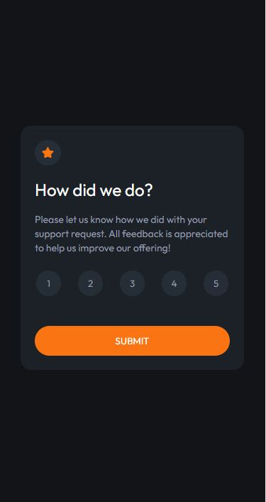
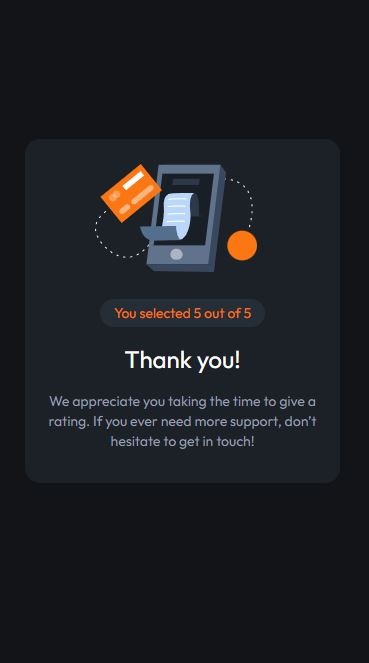

# Frontend Mentor - Interactive rating component solution

This is a solution to the [Interactive rating component challenge on Frontend Mentor](https://www.frontendmentor.io/challenges/interactive-rating-component-koxpeBUmI). Frontend Mentor challenges help you improve your coding skills by building realistic projects. 

## Table of contents

- [Overview](#overview)
  - [The challenge](#the-challenge)
  - [Screenshot](#screenshot)
  - [Links](#links)
- [My process](#my-process)
  - [Built with](#built-with)
  - [What I learned](#what-i-learned)
  - [Continued development](#continued-development)
  - [Useful resources](#useful-resources)
- [Author](#author)
- [Acknowledgments](#acknowledgments)

**Note: Delete this note and update the table of contents based on what sections you keep.**

## Overview

### The challenge

Users should be able to:

- View the optimal layout for the app depending on their device's screen size
- See hover states for all interactive elements on the page
- Select and submit a number rating
- See the "Thank you" card state after submitting a rating

### Screenshot

### Links

- Solution URL: [Add solution URL here](https://your-solution-url.com)
- Live Site URL: [Add live site URL here](https://your-live-site-url.com)

## My process

I styled each card and then worked on the JavaScript portion to get them to display one at a time.

### Built with

- Semantic HTML5 markup
- Flexbox
- Mobile-first workflow
- JavaScript

### What I learned

Through this project, I learned how to make the background color of buttons stay a certain color once they're clicked. I also learned how to hide one card until a triggering event happens and then having it show up on screen.

 submit_btn.addEventListener('click', e =>{
        Card2.classList.remove('hide')
        Card1.classList.add('hide')
    })

### Continued development

I am going to choose more challenges on Frontend Mentor that include JavaScript so I can get more practice with event listeners and JS in general.

### Useful resources

- [MDN Web Docs - CSS/:focus](https://developer.mozilla.org/en-US/docs/Web/CSS/:focus) - This helped me with understanding how to make my number buttons hold a solid orange background color once clicked.

## Author

- LinkedIn - [Ashley Serrano-Ziel](https://www.linkedin.com/in/ashley-serrano-ziel-375bb0b1/)
- Frontend Mentor - [@aszcoding](https://www.frontendmentor.io/profile/aszcoding)

## Acknowledgments

@Esesosa-max's YouTube video on this challenge really helped me with the JS portion.

